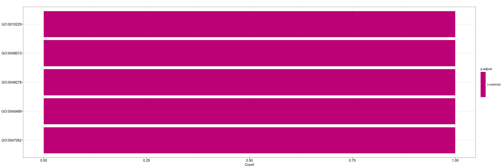
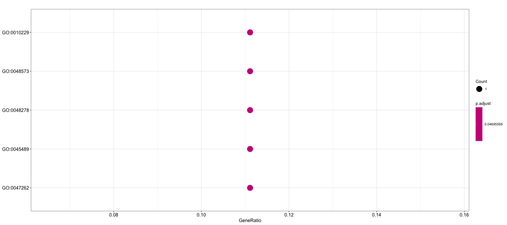
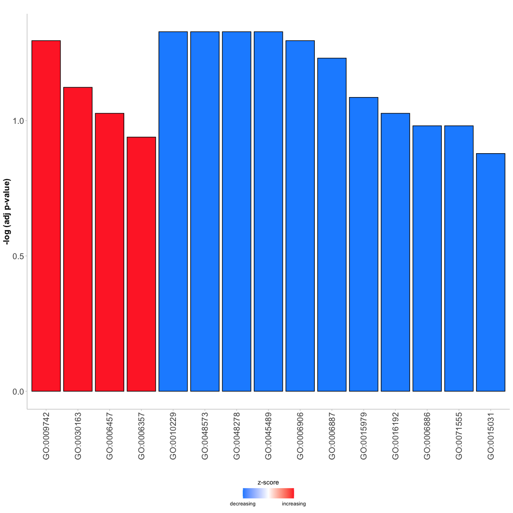

Basic GO Analysis with osgo
================
Dan MacLean
09 December, 2022

## osgo

`osgo` is a package for generating GO analysis using *O.sativa* genes
only. You can provide the main function with the list of genes of
interest and it does (most of) the rest!

## Installation

To install you’ll need the `devtools` R package. From the R console in
RStudio type

``` r
install.packages("devtools")
```

Once `devtools` is installed you can use that to install `mogo`

``` r
devtools::install_github("TeamMacLean/osgo")
```

## Preparation

The first step is to load our gene expression data file and get a simple
list of genes for GO analysis

### Data loading

First read in your gene expression file. You can do that with
`read_csv()`. Minimally it should contain the gene ID, the log fold
change and the $p$-value.

``` r
library(readr)
library(dplyr)
library(here)

gene_expression <- read_csv(system.file("extdata", "sample_gene_expression.csv", package = "osgo", mustWork = TRUE))
gene_expression
#> # A tibble: 132 × 3
#>    gene_id         log2fc  p.adj
#>    <chr>            <dbl>  <dbl>
#>  1 transcript-psbF  3.53  0.291 
#>  2 Os01t0814150-00  1.51  0.217 
#>  3 Os06t0240025-00 -7.03  0.255 
#>  4 Os02t0612100-01 -7.19  0.377 
#>  5 Os12t0409800-01  2.11  0.174 
#>  6 Os02t0780000-00 -3.04  0.183 
#>  7 Os08t0548900-01 -0.341 0.199 
#>  8 Os11t0215100-01  3.60  0.0434
#>  9 Os10t0439700-00 -3.36  0.309 
#> 10 Os03t0812300-01 -4.93  0.157 
#> # … with 122 more rows
```

### Filter as required

We can now filter the genes to select only the ones with e.g
$p <= 0.05$, using `filter()`

``` r
filtered_gene_expression <- filter(gene_expression, p.adj <= 0.05)
filtered_gene_expression
#> # A tibble: 16 × 3
#>    gene_id         log2fc    p.adj
#>    <chr>            <dbl>    <dbl>
#>  1 Os11t0215100-01  3.60  0.0434  
#>  2 Os05t0533900-01  3.51  0.00180 
#>  3 Os08t0527766-00  0.462 0.0174  
#>  4 Os08t0395700-01 -1.30  0.0215  
#>  5 Os03t0332900-01  0.539 0.0398  
#>  6 Os06t0603000-01 -4.53  0.0360  
#>  7 Os02t0536300-00 -8.60  0.000341
#>  8 Os06t0156801-00  7.58  0.0353  
#>  9 Os03t0787000-01 -0.674 0.00469 
#> 10 Os10t0540050-00 -1.63  0.0322  
#> 11 Os05t0551500-02 -6.62  0.0437  
#> 12 Os12t0434801-00 -2.27  0.0440  
#> 13 Os09t0286600-01 -1.67  0.0439  
#> 14 Os01t0147200-02  0.574 0.0324  
#> 15 Os04t0387300-01  5.88  0.00736 
#> 16 Os03t0413400-01 -0.932 0.0440
```

### Extract the gene id column

We can now extract the `gene_id` column using the `$` syntax

``` r
gene_ids <- filtered_gene_expression$gene_id
gene_ids
#>  [1] "Os11t0215100-01" "Os05t0533900-01" "Os08t0527766-00" "Os08t0395700-01"
#>  [5] "Os03t0332900-01" "Os06t0603000-01" "Os02t0536300-00" "Os06t0156801-00"
#>  [9] "Os03t0787000-01" "Os10t0540050-00" "Os05t0551500-02" "Os12t0434801-00"
#> [13] "Os09t0286600-01" "Os01t0147200-02" "Os04t0387300-01" "Os03t0413400-01"
```

## GO enrichment

The GO enrichment is done in the `osgo` package. Load that and use the
`do_enrich()` function, passing it the vector of `gene_ids` to calculate
the enrichment. **Note that you must here specify which *O.sativa* group
you use.** Use the `which` argument with either `"indica"` or
`"japonica"`. Choose the type of information you prefer to use as
labels: `"go"` for the <GO:number>, `"name"` for the GO name, or
`"description"` for the long description.

``` r
library(osgo)
enrich <- do_enrich(gene_ids, which = "japonica", label_type = "go")
enrich
#> #
#> # over-representation test
#> #
#> #...@organism     UNKNOWN 
#> #...@ontology     UNKNOWN 
#> #...@gene     chr [1:16] "Os11t0215100-01" "Os05t0533900-01" "Os08t0527766-00" ...
#> #...pvalues adjusted by 'BH' with cutoff <0.05 
#> #...5 enriched terms found
#> 'data.frame':    5 obs. of  9 variables:
#>  $ ID         : chr  "GO:0010229" "GO:0048573" "GO:0048278" "GO:0045489" ...
#>  $ Description: chr  "GO:0010229" "GO:0048573" "GO:0048278" "GO:0045489" ...
#>  $ GeneRatio  : chr  "1/9" "1/9" "1/9" "1/9" ...
#>  $ BgRatio    : chr  "12/27807" "13/27807" "22/27807" "24/27807" ...
#>  $ pvalue     : num  0.00388 0.0042 0.0071 0.00774 0.00838
#>  $ p.adjust   : num  0.047 0.047 0.047 0.047 0.047
#>  $ qvalue     : num  0.0212 0.0212 0.0212 0.0212 0.0212
#>  $ geneID     : chr  "Os06t0603000-01" "Os06t0603000-01" "Os03t0787000-01" "Os03t0413400-01" ...
#>  $ Count      : int  1 1 1 1 1
#> #...Citation
#>  T Wu, E Hu, S Xu, M Chen, P Guo, Z Dai, T Feng, L Zhou, W Tang, L Zhan, X Fu, S Liu, X Bo, and G Yu.
#>  clusterProfiler 4.0: A universal enrichment tool for interpreting omics data.
#>  The Innovation. 2021, 2(3):100141
```

As you can see the `enrich` object has a lot of information in it. The
result table can be extracted using `as.data.frame()` to convert the
`enrich` to a data.frame (note `glimpse` is a helpful function for
printing out big dataframes).

``` r
result_table <- as.data.frame(enrich)
glimpse(result_table)
#> Rows: 5
#> Columns: 9
#> $ ID          <chr> "GO:0010229", "GO:0048573", "GO:0048278", "GO:0045489", "G…
#> $ Description <chr> "GO:0010229", "GO:0048573", "GO:0048278", "GO:0045489", "G…
#> $ GeneRatio   <chr> "1/9", "1/9", "1/9", "1/9", "1/9"
#> $ BgRatio     <chr> "12/27807", "13/27807", "22/27807", "24/27807", "26/27807"
#> $ pvalue      <dbl> 0.003877773, 0.004200317, 0.007099035, 0.007742175, 0.0083…
#> $ p.adjust    <dbl> 0.04695569, 0.04695569, 0.04695569, 0.04695569, 0.04695569
#> $ qvalue      <dbl> 0.02118302, 0.02118302, 0.02118302, 0.02118302, 0.02118302
#> $ geneID      <chr> "Os06t0603000-01", "Os06t0603000-01", "Os03t0787000-01", "…
#> $ Count       <int> 1, 1, 1, 1, 1
```

You can save the result to an excel-compatible csv file with,
`write_csv()`

``` r
write_csv(result_table, "my_GO_results.csv")
```

## Plotting

The `enrich` object is from the package `ClusterProfiler` and can be
used directly in most of it’s plot types. See them at the
`ClusterProfiler` page
<http://yulab-smu.top/clusterProfiler-book/chapter12.html#bar-plot>

### Barplot

Works ok, but the text can make it a bit unwieldy

``` r
library(clusterProfiler)
#> clusterProfiler v4.6.0  For help: https://yulab-smu.top/biomedical-knowledge-mining-book/
#> 
#> If you use clusterProfiler in published research, please cite:
#> T Wu, E Hu, S Xu, M Chen, P Guo, Z Dai, T Feng, L Zhou, W Tang, L Zhan, X Fu, S Liu, X Bo, and G Yu. clusterProfiler 4.0: A universal enrichment tool for interpreting omics data. The Innovation. 2021, 2(3):100141
#> 
#> Attaching package: 'clusterProfiler'
#> The following object is masked from 'package:stats':
#> 
#>     filter
library(enrichplot)
barplot(enrich, showCategory = 5)
```

<!-- -->

### Dotplot

Similar

``` r
dotplot(enrich, showCategory = 5)
```

<!-- -->

### UpSetPlot

These are like a really sophisticated Venn/Euler diagram.
<https://jku-vds-lab.at/tools/upset/>

``` r
upsetplot(enrich)
```

<!-- -->

### GoPlot

Plots from the package `GoPlot` such as bubble plots can be made, but
need you to convert the `enrich` object to a DAVID compatible object,
and make an accessory data.frame of the expression information. Use
`enricher_to_david()` for the first part, and the relevant columns of
the gene expression data you created at the beginning for the second
part. **Note that for david conversion you must here specify which
*O.sativa* group you use.** Use the `which` argument with either
`"indica"` or `"japonica"`.

``` r
david <- enricher_to_david(enrich, which = "japonica")
expr_info <- data.frame(
  ID = filtered_gene_expression$gene_id,
  logFC = filtered_gene_expression$log2fc
)
```

Then you can convert that to the data format needed for `GoPlot`

``` r
library(GOplot)
#> Loading required package: ggplot2
#> Loading required package: ggdendro
#> Loading required package: gridExtra
#> 
#> Attaching package: 'gridExtra'
#> The following object is masked from 'package:dplyr':
#> 
#>     combine
#> Loading required package: RColorBrewer
circ <- circle_dat(david, expr_info)
```

### Go Bar

A different sort of GO barchart

``` r
GOBar(subset(circ, category == 'BP'))
```

<!-- -->

### Go Bubble

A plot with bubbles

``` r
GOBubble(circ, labels = 1)
```
